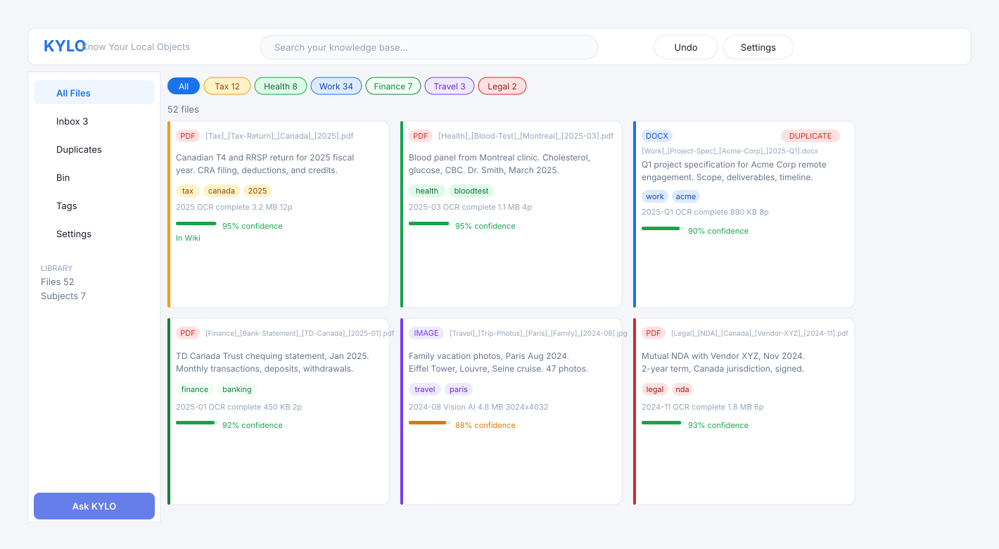

# KYLO — Know Your Local Objects

A local-first personal file intelligence system. Drop a file in — KYLO reads it, names it, and makes it findable forever. 100% local. Zero external API calls.

## Preview

[](https://excalidraw.com/#json=Rdl0x7BMQsfDqS4YLYQHm,xIxEcxqPv_gSYQClNdc2Ug)

> [View interactive wireframe →](https://excalidraw.com/#json=Rdl0x7BMQsfDqS4YLYQHm,xIxEcxqPv_gSYQClNdc2Ug)



---

## Quick Start

**Windows:** Double-click `start.bat`
**macOS/Linux:** `bash start.sh`

Then open **http://localhost:8765**

See [INSTALL.md](INSTALL.md) for full setup instructions.

---

## What It Does

| Feature | Description |
|---|---|
| **Smart naming** | AI reads your file and proposes `[Subject]_[What]_[Where]_[Who]_[When].ext` |
| **Duplicate detection** | 4-level detection: MD5 hash, text hash, semantic similarity, perceptual hash |
| **Natural language query** | "What did my doctor say about cholesterol in 2024?" — answered from your files |
| **OCR** | Tesseract extracts text from scanned PDFs and images |
| **Vision AI** | Ollama vision model describes and classifies images |
| **Undo everything** | Every file operation logged before execution, fully reversible |
| **PKM wiki integration** | Auto-queues files to your personal knowledge base |
| **USB portable** | Lives on an external drive, works on any machine |

---

## Naming Convention

Files are organized by name, not folders. The convention is:

```
[Subject]_[What]_[Where]_[Who]_[When].ext
```

Examples:
```
[Tax]_[Tax-Return]_[Canada]_[Self]_[2025].pdf
[Health]_[Blood-Test]_[Montreal]_[Dr-Smith]_[2025-03].pdf
[Work]_[Project-Spec]_[Remote]_[Acme-Corp]_[2025-Q1].docx
[Finance]_[Bank-Statement]_[TD-Canada]_[Personal]_[2025-01].pdf
[Travel]_[Trip-Photos]_[Paris]_[Family]_[2024-08].jpg
[Legal]_[NDA]_[Canada]_[Vendor-XYZ]_[2024-11].pdf
```

The AI derives all five segments from file content and proposes the name before renaming.

---

## Requirements

| Requirement | Notes |
|---|---|
| Python 3.10+ | https://python.org |
| [Ollama](https://ollama.com) | For AI classification and querying |
| Tesseract OCR | Optional — for scanned PDF support |

### Pull Ollama models (once, ~3 GB):
```
ollama pull gemma3:4b
ollama pull nomic-embed-text
```

---

## Tech Stack

| Layer | Technology |
|---|---|
| Backend | Python / FastAPI |
| AI | Ollama (`gemma3:4b`) — text + vision |
| Embeddings | `nomic-embed-text` via Ollama |
| Vector store | ChromaDB (local, embedded) |
| OCR | Tesseract via pytesseract |
| Database | SQLite |
| Frontend | HTML5 / CSS3 / Vanilla JS — no build step |

---

## Configuration

Edit `config.json` (or use the Settings page in the UI):

```json
{
  "ollama_text_model": "gemma3:4b",
  "ollama_embed_model": "nomic-embed-text",
  "pkm_wiki_path": "../PKM_WIKI",
  "auto_approve_naming": false,
  "semantic_dedup_threshold": 0.92,
  "port": 8765
}
```

---

## External Drive Portability

KYLO is designed to live on an external drive alongside a PKM Wiki:

```
/ExternalDrive/
├── _DRIVE_HOME       ← empty marker file (create once)
├── _env/             ← shared Python venv (auto-created on first run)
├── KYLO/             ← this project
└── PKM_WIKI/         ← optional companion wiki
```

All paths are relative. The drive letter can change between machines — KYLO finds its root via `_DRIVE_HOME`.

---

## License

MIT
